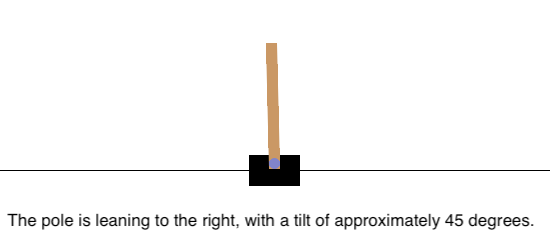
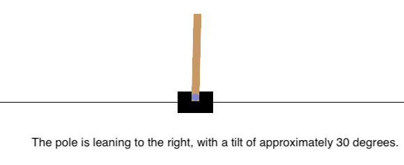
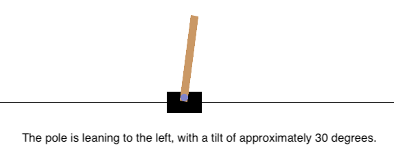

# 🌋 LLAVA-Integrated Deep Q-Network for CartPole Environment

## Disclaimer
This is a forked project from LLava. The original project can be found [here](https://github.com/haotian-liu/LLaVA). For installation, usage policy and other information regarding LLava, please refer to the original project.

## Overview

This project demonstrates the integration of a Vision-Language Model (VLM), specifically **LLaVA-7B**, as a reward function within the **CartPole-v1** environment using a **Deep Q-Network (DQN)** agent. The objective is to evaluate the capability of the VLM to interpret visual data and generate meaningful reward signals to guide the reinforcement learning agent's training process.

## Features

- **Vision-Language Model Integration:** Utilizes LLaVA-7B to generate rewards based on visual input from the CartPole environment.
- **Deep Q-Network Agent:** Implements a standard DQN agent for training within the environment.
- **Sample Image Saving:** Saves the first 10 images processed by the VLM in the `samples/` directory for inspection.
- **Customizable Prompts:** Allows experimentation with different prompts to optimize VLM performance.

## Usage
* Follow the instructions in the original project to install the required dependencies and set up the environment.
* Adjust hyperparameters and prompt as needed in `cartpole_llava.py`.
* `python cartpole_llava.py  --model-path liuhaotian/llava-v1.5-7b `

## Results
Throughout the experiments, we observed that the LLaVA model consistently reported the pole's tilt degree as exactly 45 or 30 degrees, irrespective of the actual angle depicted in the environment's rendered images. This uniform output occurred even when the pole was visibly leaning significantly more or less than the reported degree to either side. Such behavior indicates a lack of nuanced understanding and adaptability in the model's visual interpretation capabilities within this specific task. 

Below are some sample images and corresponding LLaVA outputs from the CartPole environment:

From these observations, we conclude that smaller-scale models like LLaVA 7B are currently inadequate for precise reward generation tasks that require detailed visual interpretation and quantitative reasoning. The inability to dynamically assess and report varying degrees of pole tilt suggests that more sophisticated or larger models may be necessary to achieve reliable and meaningful reward signals in reinforcement learning environments.

